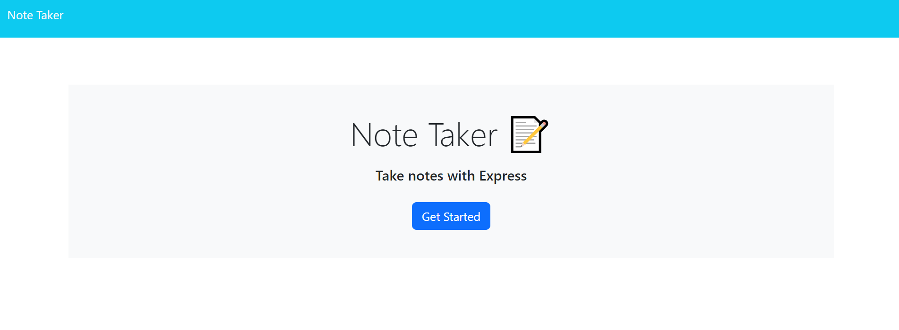
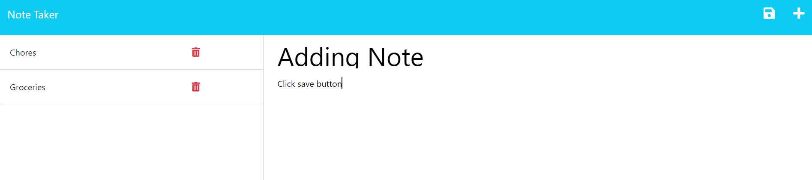
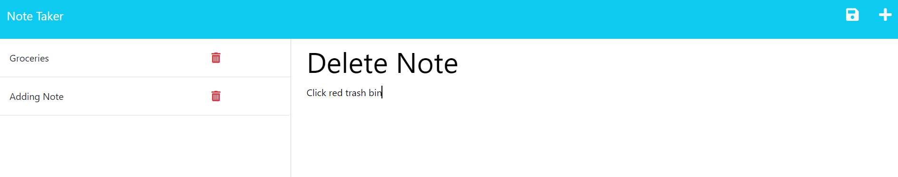

# Note Taker Challenge 11
  [](https://opensource.org/licenses/)

## Table of Contents
* [Description](#description)
* [Dependencies](#dependencies)
* [User Story](#user-story)
* [Application Preview](#application-preview)
* [License](#license)
* [Heroku Link](#heroku-link)
* [GitHub Link](#github-link)
* [Credits](#credits)

## Description
Note Taker helps users keep track of their busy schedules.  With Note Taker, users can easily make, save, and delete notes!

## Dependencies
Run the following commands in CLI to install dependencies:

Express 
```bash
npm install express
```
UUID
```bash
npm install uuid
```

## User Story
```
GIVEN a note-taking application
WHEN I open the Note Taker
THEN I am presented with a landing page with a link to a notes page
WHEN I click on the link to the notes page
THEN I am presented with a page with existing notes listed in the left-hand column, plus empty fields to enter a new note title and the note’s text in the right-hand column
WHEN I enter a new note title and the note’s text
THEN a Save icon appears in the navigation at the top of the page
WHEN I click on the Save icon
THEN the new note I have entered is saved and appears in the left-hand column with the other existing notes
WHEN I click on an existing note in the list in the left-hand column
THEN that note appears in the right-hand column
WHEN I click on the Write icon in the navigation at the top of the page
THEN I am presented with empty fields to enter a new note title and the note’s text in the right-hand column
```
## Application Preview
* Landing Page



* Add Note



* Delete Note


## License
Licensed under the MIT license.

## Heroku Link
[Heroku URL](https://polar-atoll-05727-e162f7869a1c.herokuapp.com/)

## GitHub Link
[Git Hub Repo](https://github.com/SarahSquyres/note-taker)
 
 

## Credits
I would like to thank my tutor, Faran, for getting me started on this project.

The following websites also helped guide me through this project:

* https://github.com/ThomasCalle/Thomas-Express-JS-Note-Taker/blob/44c55fad6f5e518236a1db6722f0dda2434691d6/routes/api-routes.js

* https://github.com/Krenbot/note-taker/blob/main/server.js

* https://bard.google.com/